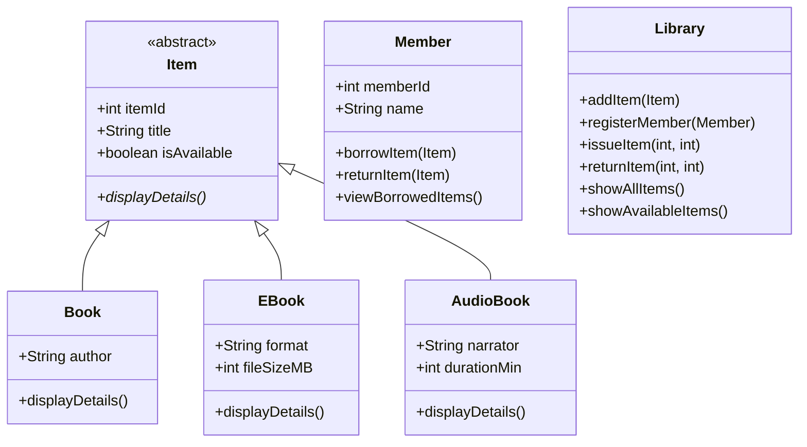

# Library Management System (OOP)

## Project Summary
A simple, console-based library management system built in pure Java using core Object-Oriented Programming principles.
Perfect for learning Encapsulation, Abstraction, Inheritance & Polymorphism!

## Technologies
- Pure Java (no external libraries)
- Arrays for storage (easy to upgrade to ArrayList later)

## OOP Concepts

| Concept       | Description                                                                 |
|---------------|-----------------------------------------------------------------------------|
| Encapsulation | Private fields with public getters and setters to control access            |
| Abstraction   | Abstract class `Item` provides a template for all library items            |
| Inheritance   | `Book`, `EBook`, and `AudioBook` classes extend the abstract `Item` class   |
| Polymorphism  | Each subclass overrides `displayDetails()` to show item-specific details    |


## Features
- Add Books, EBooks and AudioBooks
- Register members
- Issue & return items with validation
- Show all items or only available ones
- Fully interactive menu


## Sample Usage
```text
======== LIBRARY MENU ========
1. Issue Item
2. Return Item
3. Show All Items
4. Show Available Items
5. Exit
===============================

Item "Core Java" added successfully
Item "Advance Java" added successfully
Item "Spring Boot" added successfully

Member "Farry" Registered successfully
Member "Ayesha" Registered successfully
Member "Rahul" Registered successfully

======== LIBRARY MENU ========
1. Issue Item
2. Return Item
3. Show All Items
4. Show Available Items
5. Exit
===============================
Enter your choice: 1
Enter Item ID to issue: 1
Enter Member ID: 101
Item "Core Java" issued successfully to Farry

======== LIBRARY MENU ========
1. Issue Item
2. Return Item
3. Show All Items
4. Show Available Items
5. Exit
===============================
Enter your choice: 1
Enter Item ID to issue: 2
Enter Member ID: 102
Item "Advance Java" issued successfully to Ayesha

======== LIBRARY MENU ========
1. Issue Item
2. Return Item
3. Show All Items
4. Show Available Items
5. Exit
===============================
Enter your choice: 1
Enter Item ID to issue: 3
Enter Member ID: 103
Item "Spring Boot" issued successfully to Rahul

======== LIBRARY MENU ========
1. Issue Item
2. Return Item
3. Show All Items
4. Show Available Items
5. Exit
===============================
Enter your choice: 2
Enter Item ID to return: 3
Enter Member ID: 103
Item "Spring Boot" returned successfully by Rahul

======== LIBRARY MENU ========
1. Issue Item
2. Return Item
3. Show All Items
4. Show Available Items
5. Exit
===============================
Enter your choice: 3
====== ALL LIBRARY ITEMS ======
Item [ID: 1, Title: Core Java, Author: James Gosling, Available: false]
Item [ID: 2, Title: Advance Java, Author: Rod Johnson, Available: false]
Item [ID: 3, Title: Spring Boot, Author: Grady Booch, Available: true]

======== LIBRARY MENU ========
1. Issue Item
2. Return Item
3. Show All Items
4. Show Available Items
5. Exit
===============================
Enter your choice: 4
====== AVAILABLE ITEMS ========
Item [ID: 3, Title: Spring Boot, Author: Grady Booch, Available: true]

======== LIBRARY MENU ========
1. Issue Item
2. Return Item
3. Show All Items
4. Show Available Items
5. Exit
===============================
Enter your choice: 1
Enter Item ID to issue: 1
Enter Member ID: 101
Item Core Java is not available.

======== LIBRARY MENU ========
1. Issue Item
2. Return Item
3. Show All Items
4. Show Available Items
5. Exit
===============================
Enter your choice: 5
Exiting... Goodbye!
```
```
```

## Class Diagram



## How to Run
- Open the project in a Java IDE (Eclipse, IntelliJ, VS Code)
- Compile all classes in the src/ directory
- Run the Main.java class
- Follow the interactive menu to manage library operations

## Future Improvements
- Replace arrays with ArrayList or other dynamic collections
- Implement search functionality by title, author, or category
- Add due dates and fine calculation for overdue items
- Include file/database persistence to store library data permanently
- Enhance UI with a GUI or web interface

## 📸 Screenshots - Output Console

### Library Menu & Sample Output


### Issuing Items


### Returning Items


### Viewing All & Available Items


### Exit & Final Menu

